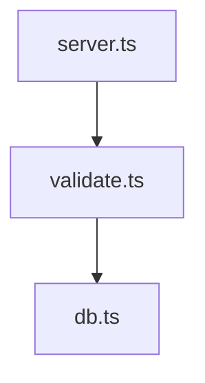

<p align="center">
  
</p>

<p align="center">
  Browse a codebase as a hierarchy of mermaid diagrams, without leaving VS Code.<br>
  The diagrams are the spec; the code is what implements them.
</p>

<p align="center">
  <em>“You can outsource your thinking, but you can't outsource your understanding.”</em><br>
  — Andrej Karpathy
</p>

---

## What it is

codeswim is a VS Code extension that renders the mermaid blocks inside
your markdown files as a clickable navigation surface. Click a node to
drill into a child diagram or jump straight to the source file it
represents. A coverage analyzer keeps diagrams and code aligned, both
from a button inside the editor and as a CLI for agents and CI.

The companion desktop app lives at
[codeswim](https://github.com/keithagroves/codeswim); both tools read
the same project format.

## Try it

Point codeswim at
[codeswim-example](https://github.com/keithagroves/codeswim-example) —
a small runnable demo codebase with an `overview.md` at the root and a
full diagram tree underneath. That's the fastest way to see what the
format looks like in practice.

## Use

1. Open a markdown file containing one ` ```mermaid ` block.
2. Click the structure icon in the editor's title bar, press
   `Cmd+K V` (Mac) / `Ctrl+K V`, or run **codeswim: Open** from the
   command palette.
3. Click a node in the rendered diagram.

The **Diagrams** view in the activity bar is rooted at the workspace's
`overview.md`. If one doesn't exist, the view offers a **Create
overview.md** action that scaffolds one.

## Features

- **Side-panel preview** that follows the active markdown file
- **Clickable navigation** — `click NodeId call navigate("./path.md")`
  opens the target as another diagram (with breadcrumbs);
  `navigate("./src/foo.ts")` opens the file in the editor area;
  `#L10-L22` jumps to and highlights a line range
- **Breadcrumbs** for navigation history — click any crumb to jump back
- **Live reload** — unsaved edits re-render immediately; external file
  changes also refresh
- **Activity-bar Diagrams view** rooted at `overview.md`
- **Check Coverage** — verifies every source file is reachable from a
  diagram and every diagram is reachable from `overview.md`
- **`codeswim-coverage` CLI** — same analysis from the shell, for
  agents and CI

## The format

Every diagram lives in a markdown file with three parts: YAML
frontmatter, a short prose paragraph, and exactly one mermaid block.

````markdown
---
name: API surface
description: HTTP routes exposed by the server
---

The server registers routes lazily. Validation lives in `validate.ts`;
persistence lives in `db.ts`.



## Source

- `../src/server.ts` — HTTP entry point, route table
- `../src/validate.ts` — request validation
- `../src/db.ts` — Postgres queries
````

### Rules

| | |
|---|---|
| **One mermaid block per file** | The renderer only shows the first one. Extra blocks are ignored. |
| **Frontmatter is required** | `name` and `description`. The description shows up in tooltips and tree views — make it specific. |
| **Every flowchart node needs a click handler** | `click NodeId call navigate("…")`. If a node has no obvious target, point at the parent diagram or `overview.md`. |
| **`click` is flowchart-only** | Sequence/class/state/ER diagrams don't support it. For those, put the links in the prose below as bullets. |
| **Line refs are encouraged** | `navigate("../src/server.ts#L25-L40")` jumps to and highlights those lines. `#L42` for a single line. 1-indexed, inclusive. |
| **Link to files, not directories** | `[migrations](../src/db/migrations/)` is broken — point at a representative file inside instead. |
| **Architecture docs have a Source section** | A bulleted list of the files the diagram covers with a one-line role each. Makes coverage auditable. |

### Layering convention

The only hard requirement is **`overview.md` at the workspace root** —
coverage uses it as the entry for reachability. Beyond that, use
whatever folder structure the project already has. For brand-new
projects, the defaults are:

- `overview.md` — one diagram of the system's subsystems
- `architecture/<subsystem>.md` — structure diagrams with a Source list
- `flows/<flow>.md` — sequence/flowchart diagrams for specific request flows
- `decisions/adr-<n>-<slug>.md` — ADRs explaining *why*

### .codeswimignore

Place a `.codeswimignore` at the workspace root to extend the built-in
ignore list (`node_modules`, `dist`, `out`, `build`, `.git`, `.vscode`).
Syntax is a gitignore subset: globs (`*` / `**` / `?`), trailing `/`
for directory-only, leading `/` to anchor at the workspace root,
leading `!` to negate. Honored by both the extension and the CLI.

## CLI for agents and CI

The same analysis behind the **Check Coverage** button is exposed as
`codeswim-coverage` (also runnable as `node out/cli.js`):

```bash
codeswim-coverage /path/to/repo               # human-readable
codeswim-coverage /path/to/repo --json        # machine-readable
codeswim-coverage /path/to/repo --strict      # exit 1 on any drift
```

This is the agent-friendly path for verifying diagram/code alignment
without launching VS Code.

## Running locally

```bash
npm install
npm run watch       # rebuild on change
```

Open this folder in VS Code and press `F5` to launch an Extension
Development Host with the extension loaded.

## Building

```bash
npm run build       # produces out/extension.js + media/webview.js + out/cli.js
npm run package     # creates codeswim-X.Y.Z.vsix
```

Install the resulting `.vsix` via **Extensions → … → Install from
VSIX…**, or:

```bash
code --install-extension codeswim-0.1.14.vsix --force
```

## Related

- [codeswim](https://github.com/keithagroves/codeswim) — same idea as a
  standalone Electron app, with an AI agent panel.
- [codeswim-example](https://github.com/keithagroves/codeswim-example) —
  a small demo codebase to point the navigator at.
