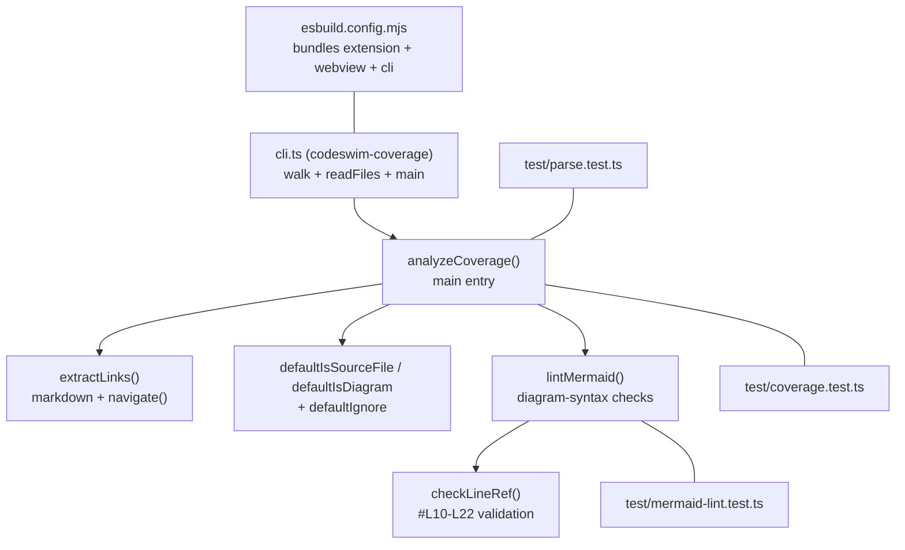

# Coverage analyzer

The same engine drives the VS Code **Check Coverage** command and the
`codeswim-coverage` CLI. Given a list of files, it reports broken
links, orphan diagrams, uncovered sources, and mermaid-syntax issues.



## What it checks

1. **Broken links** — markdown links and mermaid
   `click ... call navigate("…")` calls whose target doesn't exist in
   the file set.
2. **Orphan diagrams** — `.md` files not reachable from `overview.md`
   by transitive markdown-to-markdown links.
3. **Uncovered sources** — source files (`.ts`, `.tsx`, `.js`, …) that
   no diagram references.
4. **Mermaid issues** — `click ... call navigate()` in non-flowchart
   diagrams, `{` inside unquoted `[...]` labels, and malformed line
   refs (`#Lfoo`, `#L0`, reversed ranges).

## CLI usage

```
node out/cli.js [path]            # human-readable
node out/cli.js [path] --json     # machine-readable
node out/cli.js [path] --strict   # exit 1 on any drift
```

## Project-level ignores

Drop a [`.codeswimignore`](./.codeswimignore) at the project root to
layer extra patterns on top of the built-in defaults. Gitignore-subset
syntax: globs (`*`, `**`, `?`), `dir/` for directory-only, leading `/`
to anchor at root, leading `!` to negate. Patterns are evaluated in
order — last match wins. See [src/codeswim-ignore.ts](./src/codeswim-ignore.ts)
for the parser and [test/codeswim-ignore.test.ts](./test/codeswim-ignore.test.ts)
for the supported corner cases.

Mirrored from the Electron app's harness validator — keep both sides
in sync when adding a check ([todos.md](./todos.md) tracks open
parity work).
