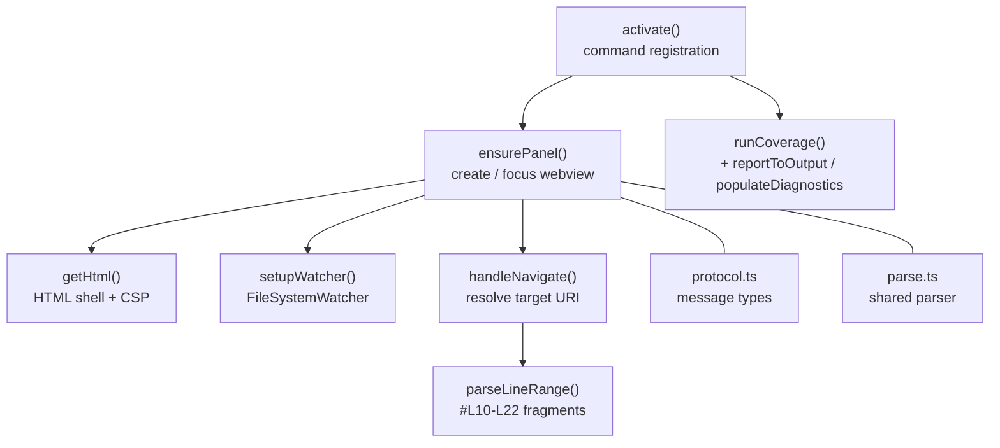

# Extension host

Runs in VS Code's Node-hosted extension host. All filesystem and
workspace API access lives here — the webview side only sees parsed
content sent over `postMessage`.

## Lifecycle in one paragraph

`activate()` registers the four commands (`showPreview`, `back`,
`revealSource`, `checkCoverage`). The first `showPreview` for a given
target creates the panel via `ensurePanel()`, which wires up the
filesystem watcher, sets the CSP HTML, and starts listening for
`FromWebview` messages. `handleNavigate()` translates a clicked node's
target into either a recursive diagram view (markdown without a line
range) or a `showTextDocument()` call with a selection range
(everything else). `runCoverage()` walks the workspace, feeds files
into `analyzeCoverage()`, and surfaces the result via the output
channel plus diagnostics.

## Related

- [src/webview.ts](./src/webview.ts) — what the host renders into.
- [coverage.md](./coverage.md) — the analyzer the host invokes.
