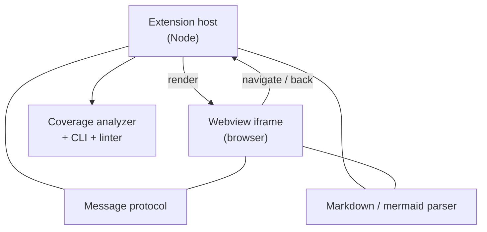

# codeswim

A VS Code extension that turns the mermaid blocks inside your markdown into
a clickable navigation surface. Two runtime pieces — the **extension host**
(Node) and the **webview iframe** (browser) — talk over `postMessage`.
A shared coverage analyzer backs both the **Check Coverage** command and
the `codeswim-coverage` CLI.

## Where to start reading

- [README.md](./README.md) — install + usage.
- [package.json](./package.json) — extension manifest: commands, menus,
  keybindings.
- [src/extension.ts](./src/extension.ts) — extension-host entry; registers
  commands and owns the panel.
- [src/webview.ts](./src/webview.ts) — webview entry; loads mermaid and
  renders the parsed file.
- [CLAUDE.md](./CLAUDE.md) — project conventions, CSP notes, "don't"
  list.
- [todos.md](./todos.md) — outstanding parity work with the Electron app.
