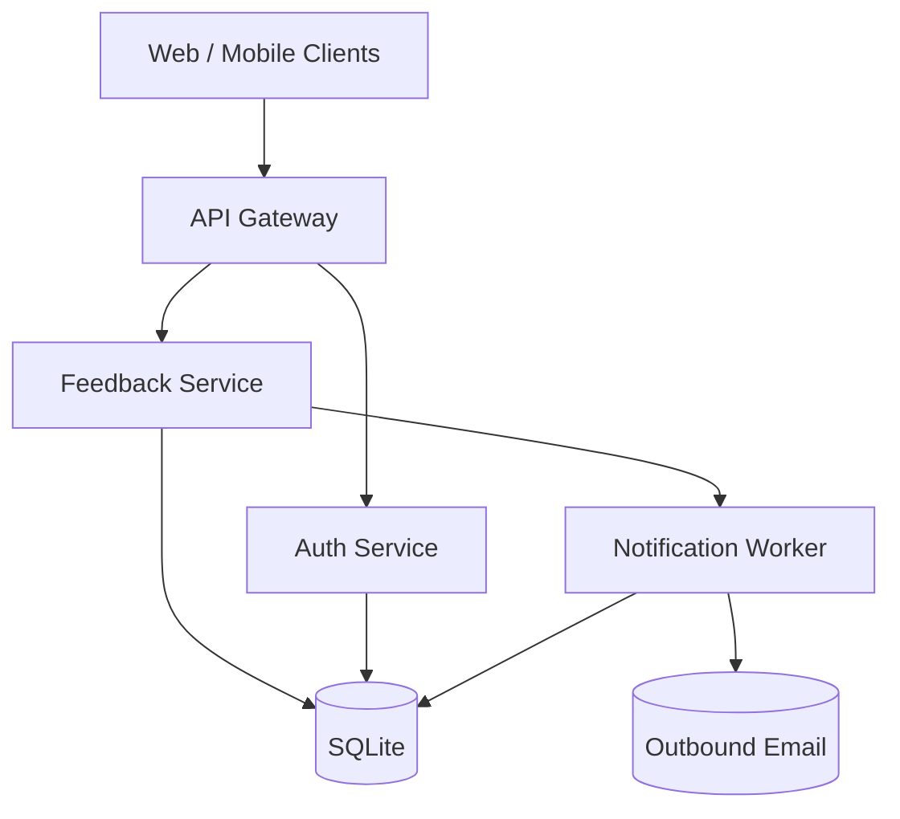

Triage is a single-tenant SaaS backend. The web/mobile clients hit a JSON API,
which validates JWTs, then routes to one of four subsystems: feedback,
notifications, auth, or persistence.

The five blocks below each link to a subsystem diagram. Pick whichever surface
you're investigating.

## Where to look first

- **Onboarding a feature?** Start at the relevant subsystem diagram.
- **Tracing a bug in a request?** Open the flow diagrams under [flows/](./flows).
- **Wondering why a thing is the way it is?** Check the [decisions/](./decisions) ADRs.

## Project conventions

- All HTTP errors are converted to `ApiError` in [src/api/middleware/error.ts](./src/api/middleware/error.ts).
- DB access goes through `src/db/client.ts`. No raw `pg` outside that file.
- Background jobs run in a separate process — see [notifications](./architecture/notifications.md).
