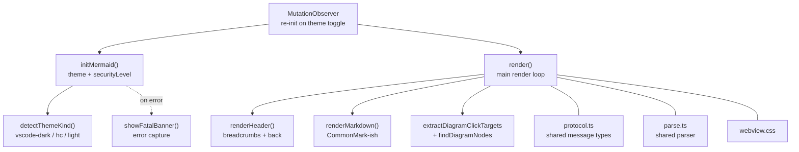

# Webview iframe

Runs inside the webview's sandboxed iframe with a strict CSP. Imports
the full mermaid bundle (~2.9 MB minified). All filesystem access is
delegated to the extension host — this side only sees content shipped
over `postMessage`.

## Dark mode

`detectThemeKind()` reads `document.body.classList` for the
`vscode-dark` / `vscode-high-contrast` markers VS Code injects.
`mermaidThemeFor()` picks `'dark'` for dark/HC-dark and `'default'`
for everything else. A `MutationObserver` watches `body.class`; when
the user swaps themes the diagram re-renders with the saved
`lastRender` payload — no extension-host round-trip needed.

## Error capture

`window.error` and `unhandledrejection` paint a fixed red banner at the
bottom of the page. Without this, silent mermaid failures look like a
blank webview (`CLAUDE.md` calls this out specifically).
